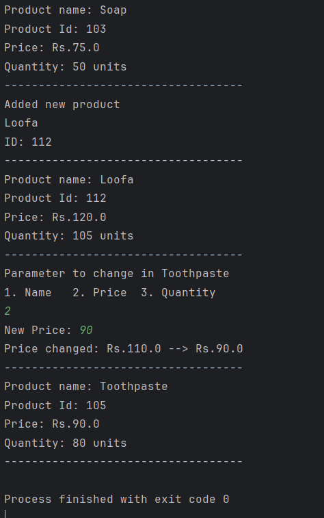
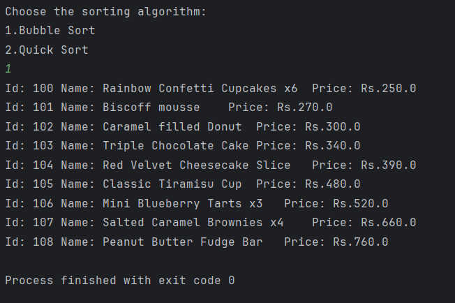
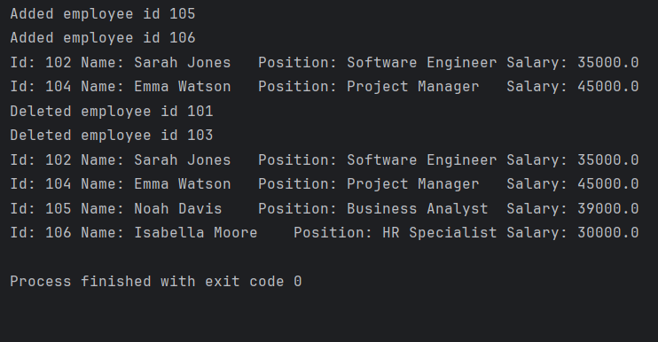
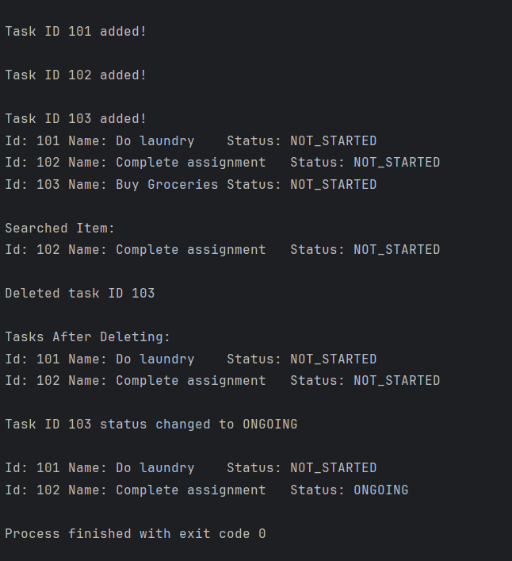
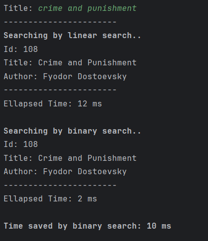
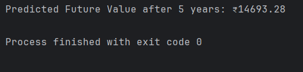

# Exercise wise outputs:

## Exercise - 1: <ins> Inventory Management System Example </ins>

## Exercise - 2: <ins> Ecommerce Searching </ins>
### Linear search

### Binary search

## Exercise - 3: <ins> Sorting Customer Orders </ins>
### Bubble Sort

### Quick Sort

## Exercise - 4: <ins> Employee Management System </ins>

## Exercise - 5: <ins> Task Management System </ins>

## Exercise - 6: <ins> Library Management System </ins>

## Exercise - 7: <ins> Financial Forecasting </ins>

