# Exercise wise outputs:

## Exercise - 1: <ins> Singleton Pattern Example </ins>

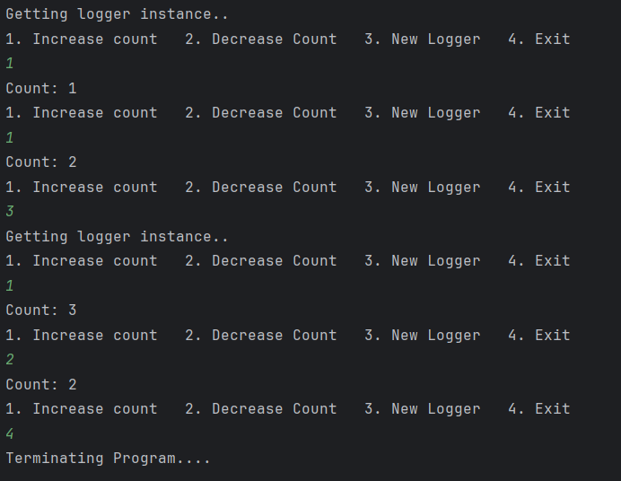

## Exercise - 2: <ins> Factory Pattern Example </ins>

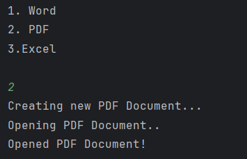

## Exercise - 3: <ins> Builder Pattern Example </ins>

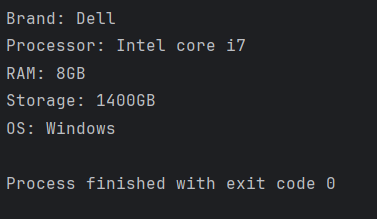

## Exercise - 4: <ins> Adapter Pattern Example </ins>

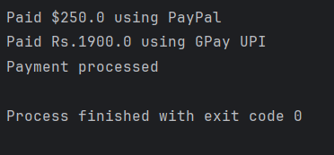

## Exercise - 5: <ins> Decorator Pattern Example </ins>

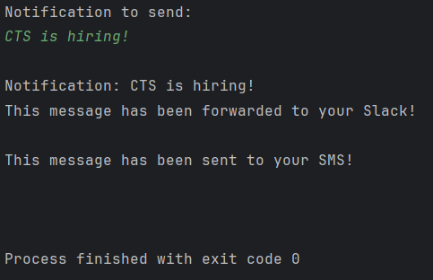

## Exercise - 6: <ins> Proxy Pattern Example </ins>

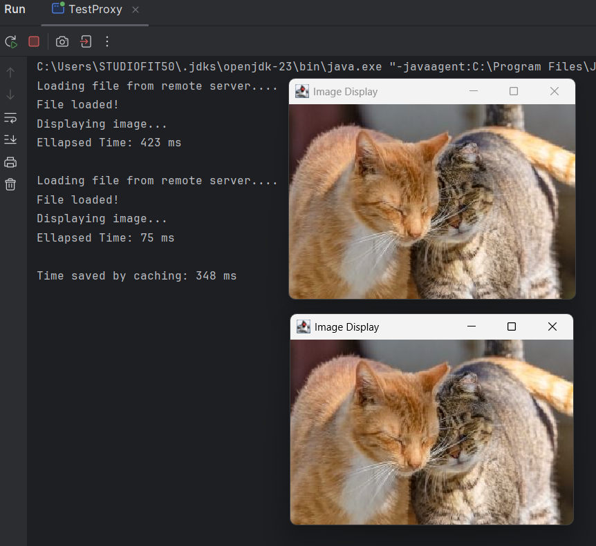

## Exercise - 7: <ins> Observer Pattern Example </ins>

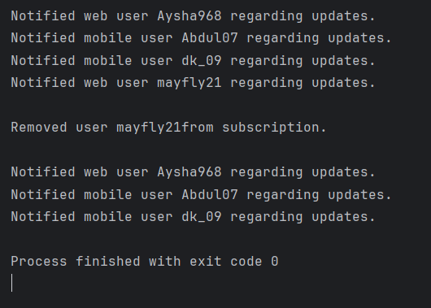

## Exercise - 8: <ins> Strategy Pattern Example </ins>

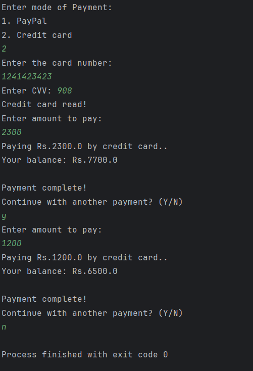
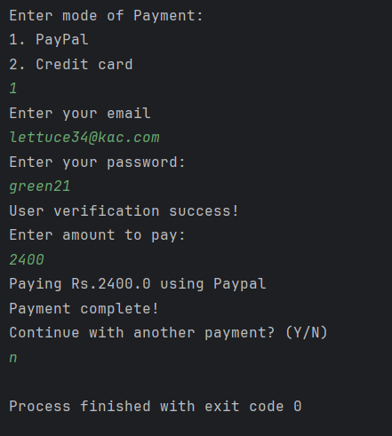

## Exercise - 9: <ins> Command Pattern </ins>

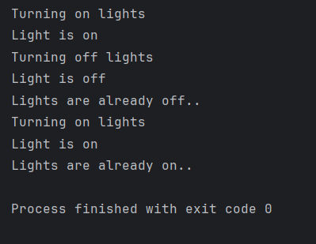

## Excercise - 10: <ins> MVC Pattern </ins>

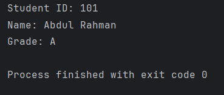

## Excercise - 11: <ins> Dependency Injection </ins>

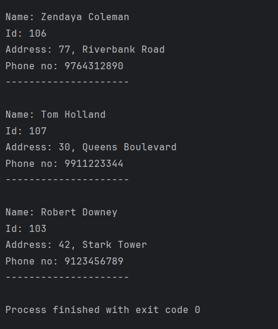